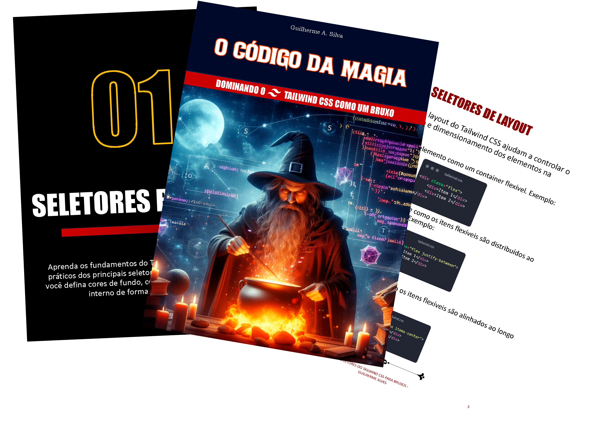

    

-------

# Projeto EBOOK Gerado por I.A.s

 > ℹ️ **NOTE:** Este é o repositório desenvolvido durante o curso no qual fui instrutor técnico na plataforma da [DIO](https://dio.me)

Projeto com o objetivo de gerar um ebook digital com as facilidades das ferramentas de IA. todos os prompts
seguem abaixo.

<a href="#" title="View PDF now"> 📕Clique aqui para ler</a>

## 💻 Tecnologias utilizadas no projeto

- [ChatGPT](https://chat.openai.com/) 
- [Microsoft Copilot](https://www.microsoft.com/pt-br/copilot-app)
- [PowerPoint](https://www.microsoft.com/en/microsoft-365/powerpoint)

## 🧠 Prompts

ChatGPT：

|   Ação   | prompt                                                                                                                                                                                                                                                                         |
| :------: | ------------------------------------------------------------------------------------------------------------------------------------------------------------------------------------------------------------------------------------------------------------------------------ |
|  título  | Crie um titulo de um ebook sobre o tema de tailwind css, o ebook é do nicho de programação e subnicho é de tailwind css, O titulo deve ser épico e curto e tenha uma temática mais nerd. e tenha uma temática de harry potter no titulo, me liste 5 variações de titulos.                                                        |
| conteúdo | Faça um texto para ebook, com foco em tailwind css, listando os principais seletores do tailwind css com exemplos em código {REGRAS} Explique sempre de uma maneira simples Deixe o texto enxuto, Sempre traga exemplos de código em contextos reais , Sempre deixe um título sugestivo por capitulo |

Copilot：

|  Ação  | prompt                                                                                 |
| :----: | -------------------------------------------------------------------------------------- |
| título | bruxo dominando a programação CSS com caldeirão de código CSS e faíscas mágicas |

## ✨ Features

- Conteúdo gerado via ChatGPT
- Imagens geradas via Microsoft Copilot

## 📚 Materiais

- Imagens utilizadas em `assets`
- ebook gerado durante as aulas em `output`

## 🛠️ Instruções de execução

Utilize os prompts acima nas ferramentas sugeridas para gerar o material base e utilize uma ferramenta de edição de documentos como power point, libreoffice , indesign para diagramação.

## 👨‍💻 Expert

    
    
&nbsp&nbsp&nbspGuilherme Alves 
    &nbsp&nbsp&nbsp
    <a href="https://github.com/bitsbygui">
    GitHub</a>&nbsp;|&nbsp;
    <a href="https://www.linkedin.com/in/guilhermealvessilva/">LinkedIn</a>
&nbsp;|&nbsp;
    <a href="https://www.instagram.com/_guilhermeallves/">
    Instagram</a>
&nbsp;|&nbsp;

  

